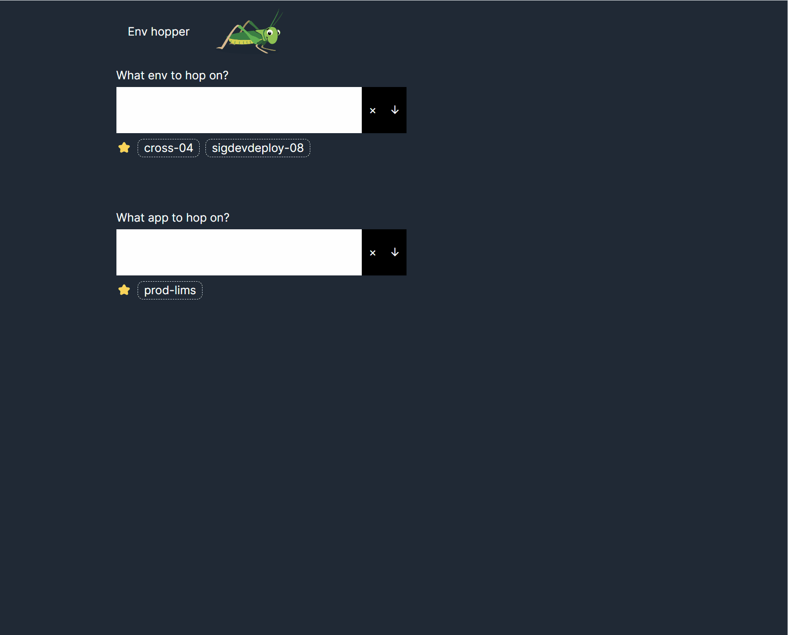

# EnvHopper

Env Hopper is web application to navigate between different environments (stagings) in organizations. 

to simplify navigation between staging environments and applications within your company.

No more manual URL typing or multiple tabs. Just select your environment, specify the application, and jump with ease.

# Stage of project

As of 2024-May-27 project is currently in development, not ready to be used on production.

# Screenshot



## Local development

```
npm install
npx nx run backend:serve
npx nx run frontend:serve
```

Navigate to `http://localhost:4001`


### Migration

Change schema in `schema.prisma` and then run
```bash
cd apps/backend
prisma generate
npx prisma migrate dev 
```
